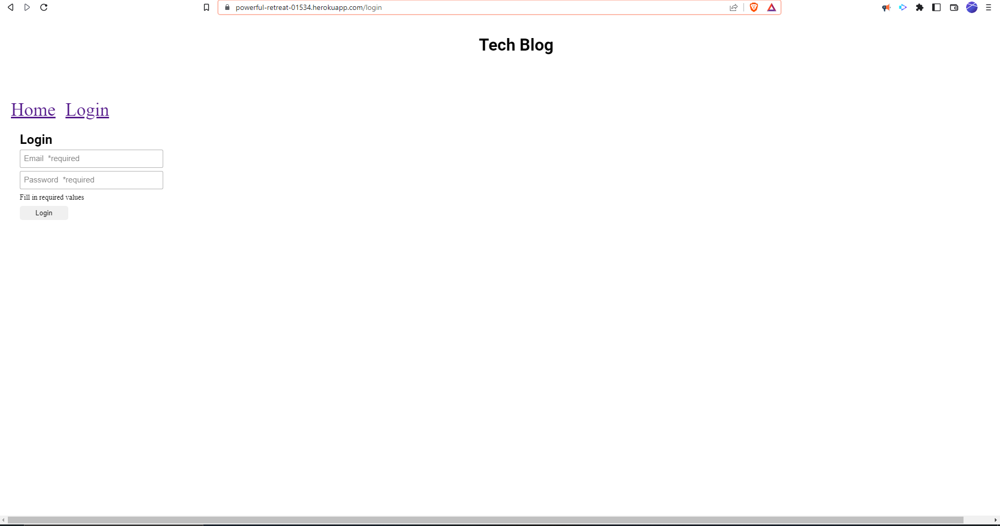

# Tech-Blog

## Licence

[](https://opensource.org/licenses/MIT)

## Table of Contents

- [Description](#Description)
- [Links](#Links) 
- [Installation](#Installation)
- [Usage](#Usage)
- [Testing](#Testing)
- [Credits](#Credits)
- [Questions](#Questions)

## Description

<br>
I'll be building a CMS-style blog site similar to a Wordpress site, where developers can publish their blog posts and comment on other developers’ posts as well. I’ll build this site completely from scratch and deploy it to Heroku. 

AS A developer who writes about tech
I WANT a CMS-style blog site
SO THAT I can publish articles, blog posts, and my thoughts and opinions

## Links

 <a href="https://powerful-retreat-01534.herokuapp.com/">Heroku link</a>

## Installation

1. Create files needed to preform the challenge.
2. Install and/or require packages.
3. Modify the code based on the Acceptance criteria.
4. Full fill the acceptances criteria grading requirements.
5. Add, Commit, and Push Repo to Github.
6. Follow the instructions to submit the Challenge for review.

## Usage

The challenge use will follow the MVC paradigm in its architectural structure, using Handlebars.js as the templating language, Sequelize as the ORM, and the express-session npm package for authentication.

## Testing
```
1. Add a .env file 
2. npm i // to install npm
3. mysql -u root -p // sign into MySQL
4. SOURCE filename.sql // inject data
5. node server.js // create the tables
6. npm run watch or npm start // to start server
7. Login into Heroku and follow the deployment instructions 
```
## Credits 
Instructor, 2u Tutor and TA.


## Questions

GitHub Username: BrownCAB
<br>E-mail: brown.calah@hotmail.com 
<br>Contact: E-mail
